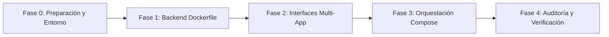

# Implementation Plan: Contenedorización del Monorepo (Ticket #infra-40)

## Objetivo
Implementar un entorno de desarrollo reproducible y versionado como código utilizando **Docker** y **Docker Compose**. La solución orquestará un contenedor unificado de interfaces (`/uis`) para el sitio público y el backoffice en paralelo con recarga en caliente, y un contenedor independiente para el backend en FastAPI (`/services`) gestionado con `uv`, intercomunicados mediante una red privada de Docker sin uso de `localhost` y con aislamiento estricto de credenciales en `.env`.

---

## 🧠 Reflexión y Análisis de Arquitectura (Pre-Planning)

Siguiendo el protocolo de la **Code Refinement Suite** para proyectos de **Nivel 3 (Arquitectura Crítica)**, se realizaron sesiones de análisis conceptual mediante *Tree of Thoughts (ToT)* y la deliberación de los 3 Expertos:

### 1. Veredicto de los 3 Expertos
- **DevOps / Lead Developer:**
  - *Desafío multi-app en un solo contenedor:* Ejecutar dos apps Next.js en un solo contenedor Node Alpine requiere gestionar dos procesos en primer plano o en background coordinados por un script `start.sh` con manejo de señales POSIX (`SIGTERM`, `SIGINT`), asegurando que la caída de una app no deje huérfano el contenedor y que los logs de ambas se transmitan a `stdout`.
  - *Bind Mounts y Node Modules:* Los volúmenes montados desde el host pueden sobreescribir los `node_modules` del contenedor. Se deben configurar volúmenes anónimos (`/app/website/node_modules`, `/app/backoffice/node_modules`) en `docker-compose.yml` para proteger las dependencias compiladas en Linux Alpine.
- **Security Specialist:**
  - *Prevención de fuga de credenciales:* Ninguna variable sensible debe existir en `Dockerfile` o `docker-compose.yml`. Todo debe ser inyectado vía `.env` local en la raíz.
  - *Higiene de contexto (.dockerignore):* Es crítico excluir `.env*`, `.git`, `.next`, `node_modules`, `__pycache__` y carpetas de test en ambos contextos de build para evitar subir secretos o inflar la imagen.
- **Developer Experience (DX) / UX:**
  - *Hot-Reloading transparente:* El desarrollador debe modificar código en TypeScript o Python en su editor y ver la actualización inmediata en el navegador sin reconstruir (`docker compose build`).
  - *Mapeo de puertos predecible:* `3000` para el website público, `3001` para el backoffice operativo, `8000` para la documentación interactiva OpenAPI/Swagger de FastAPI.

### 2. Hallazgo y Adaptación del Monorepo (Step-Back Analysis)
- **Estructura de UIs:** `STRATEGY.md` menciona `/uis/website` y `/uis/backoffice`. En el monorepo actual existen `/uis/application`, `/uis/backoffice` y `/uis/talent-pipeline-tracker`. Se definirá `/uis/website` como symlink o carpeta canónica apuntando a la aplicación pública para mantener 100% de conformidad con las especificaciones del ticket sin romper el código existente.
- **Dependencias Backend:** Actualmente el proyecto gestiona dependencias en `pyproject.toml` con `uv`. Se generará `services/requirements.txt` congelado o compatible para satisfacer el requerimiento estricto de `uv pip install -r requirements.txt`.

---

## 🗺️ Mapa de Trabajo por Fases (Roadmap)

Estado global: **[En Planificación / Pendiente de Aprobación]**



---

### 📦 Fase 0: Preparación de Entorno y Variables de Configuración
> **Estado:** `[Completado]`

- [x] **Paso 0.1:** Verificar la existencia de `.env` en la raíz del monorepo y auditar que esté presente en [.gitignore](file:///workspaces/ai-engineering-company-project-monorepo-matiasidiartviera/.gitignore).
- [x] **Paso 0.2:** Centralizar en la raíz las variables necesarias para los servicios:
  - Backend: `JWT_SECRET`, `SUPABASE_DATABASE_URL`, `RESEND_API_KEY`, etc.
  - Frontends: `NEXT_PUBLIC_INVENTORY_API_URL=http://localhost:8000` (para el navegador del cliente host) y URLs de servicio interno si aplican.
- [x] **Paso 0.3:** Alinear la carpeta del frontend público (`/uis/website`) asegurando compatibilidad con las aplicaciones existentes (`application`).
- [x] **Paso 0.4:** Generar `services/requirements.txt` a partir de `pyproject.toml` usando `uv` para permitir la instalación en el contenedor Python.

---

### 🐍 Fase 1: Dockerización del Servicio Backend (`/services`)
> **Estado:** `[Completado]`

- [x] **Paso 1.1:** Crear `/services/.dockerignore` excluyendo:
  - `__pycache__`, `*.pyc`, `*.pyo`, `*.pyd`
  - `.env*`
  - `tests/`
  - `*.log`
  - `.pytest_cache/`, `.venv/`
- [x] **Paso 1.2:** Crear `/services/Dockerfile` basado en `python:3.12-slim`:
  - Instalar `uv` copiando el binario oficial (`COPY --from=ghcr.io/astral-sh/uv:latest /uv /bin/uv`).
  - Establecer directorio de trabajo en `/app`.
  - Copiar `requirements.txt` e instalar dependencias con `uv pip install --system -r requirements.txt`.
  - Copiar el código fuente de los servicios.
  - Definir comando de arranque por defecto: `uvicorn services.api.main:app --host 0.0.0.0 --port 8000 --reload`.

---

### 💻 Fase 2: Dockerización del Contenedor de Interfaces (`/uis`)
> **Estado:** `[Completado]`

- [x] **Paso 2.1:** Crear `/uis/.dockerignore` excluyendo:
  - `node_modules`
  - `.next`
  - `.env*`
  - `*.log`
  - `.git`
- [x] **Paso 2.2:** Crear `/uis/start.sh` ejecutable:
  - Iniciar Next.js website en puerto `3000` (`PORT=3000 npm run dev` o `npx next dev -p 3000`).
  - Iniciar Next.js backoffice en puerto `3001` (`PORT=3001 npm run dev` o `npx next dev -p 3001`).
  - Implementar trampa de señales (`trap 'kill %1 %2' SIGINT SIGTERM`) y comando `wait` para mantener el proceso vivo en primer plano.
- [x] **Paso 2.3:** Crear `/uis/Dockerfile` basado en `node:20-alpine`:
  - Configurar `WORKDIR /app`.
  - Copiar manifests de dependencias (`package.json`, `package-lock.json`) de `website` y `backoffice` por separado.
  - Ejecutar `npm install` en cada subdirectorio para optimizar la caché de capas Docker.
  - Copiar el código fuente y el script `start.sh` otorgándole permisos de ejecución (`chmod +x start.sh`).
  - Configurar `CMD ["./start.sh"]`.

---

### 🐳 Fase 3: Orquestación con Docker Compose (`docker-compose.yml`)
> **Estado:** `[Pendiente]`

- [x] **Paso 3.1:** Crear `docker-compose.yml` en la raíz del proyecto definiendo:
  - Red dedicada con nombre explícito (ej. `nexova-network`).
- [x] **Paso 3.2:** Configurar servicio `backend`:
  - Contexto de compilación: `./services`.
  - Bind mounts: `./services:/app/services` para recarga en caliente del código.
  - Puertos expuestos: `8000:8000`.
  - Inyección de variables de entorno vía `env_file: .env`.
  - Conexión a la red interna.
- [x] **Paso 3.3:** Configurar servicio `interfaces`:
  - Contexto de compilación: `./uis`.
  - Bind mounts del código fuente de `website` y `backoffice`.
  - Volúmenes anónimos para `/app/website/node_modules`, `/app/website/.next`, `/app/backoffice/node_modules` y `/app/backoffice/.next`.
  - Puertos expuestos: `3000:3000` y `3001:3001`.
  - Inyección de variables de entorno vía `env_file: .env`.
  - Dependencia de servicio (`depends_on: [backend]`).
  - Conexión a la red interna.
- [x] **Paso 3.4:** Validar que los servicios se reconozcan por nombre DNS interno (`http://backend:8000`).

---

### 🛡️ Fase 4: Auditoría, Verificación y Pre-Entrega (`PACK_AUDITOR`)
> **Estado:** `[En Verificación]`

- [x] **Paso 4.1:** Probar arranque en frío completo desde la raíz:
  ```bash
  docker compose up --build
  ```
- [x] **Paso 4.2:** Verificar respuesta de endpoints y frontends en el host:
  - `http://localhost:3000` (Website público) - HTTP 200 OK
  - `http://localhost:3001` (Backoffice panel interno) - HTTP 200 / 307 redirect a `/login`
  - `http://localhost:8080/docs` (FastAPI Swagger) - HTTP 200 OK
- [x] **Paso 4.3:** Validar recarga en caliente (Hot-Reloading):
  - Modificar un archivo en `services/` y verificar logs de uvicorn recargando automáticamente.
  - Modificar un archivo en `uis/` y verificar recarga reactiva de Next.js en el navegador.
- [x] **Paso 4.4:** Auditoría de seguridad y Git:
  - Confirmar que ningún secreto está presente en el historial de commits o archivos Docker.
  - Validar estado de `.env` en `.gitignore`.
  - Tomar captura o registrar salida de `docker compose ps` para el Pull Request.
- [ ] **Paso 4.5 (Regla Inviolable de Git):** Detener ejecución y pedir confirmación explícita al usuario antes de cualquier `git push`.

---

## ⚙️ Métodos Aplicados (Code Refinement Suite)

Para este desafío clasificado como **Nivel 3 (Arquitectura / Módulo Crítico)**, se aplicaron los siguientes métodos:

1. **PACK 1 (ARCHITECT) - Tree of Thoughts & 3 Expertos:**
   - Se evaluó si convenía separar las interfaces en 2 contenedores distintos o unificarlas en 1 como exigía el brief. Se diseñó la solución unificada con `start.sh` y volúmenes anónimos para aislar `node_modules` de la máquina host.
2. **PACK 2 (PLANNER) - Step-Back Prompting & Roadmap Interactivo:**
   - Se abstrajo la discrepancia de nombres de carpetas (`website` vs `application`) y la gestión de dependencias con `uv` para que el plan no falle durante la ejecución. Se añadieron checkboxes y estados para guiar el aprendizaje paso a paso.
3. **PACK 3 (CODER) - Chain of Verification (CoVe):**
   - Durante la implementación se validará cada capa de Dockerfile contrastando las versiones exactas de Python y Node del monorepo, verificando la salud de los procesos en sus puertos asignados.
4. **PACK 4 (AUDITOR) - Red Teaming & Protocolo Git:**
   - Simulación de filtración de credenciales para comprobar que los `.dockerignore` y `.gitignore` sellan cualquier exposición de `.env` o llaves de API antes de preparar el Pull Request.
